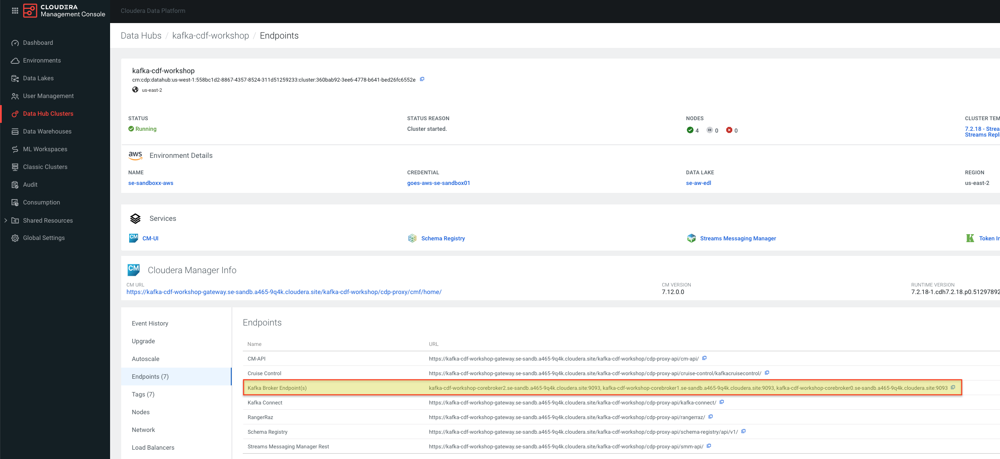
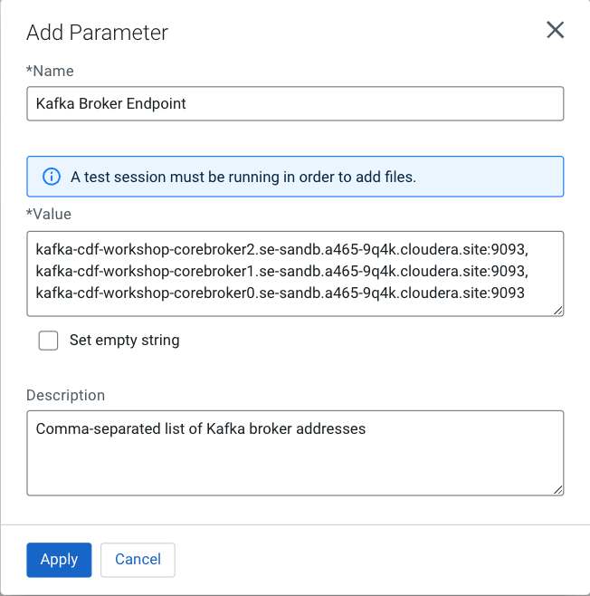
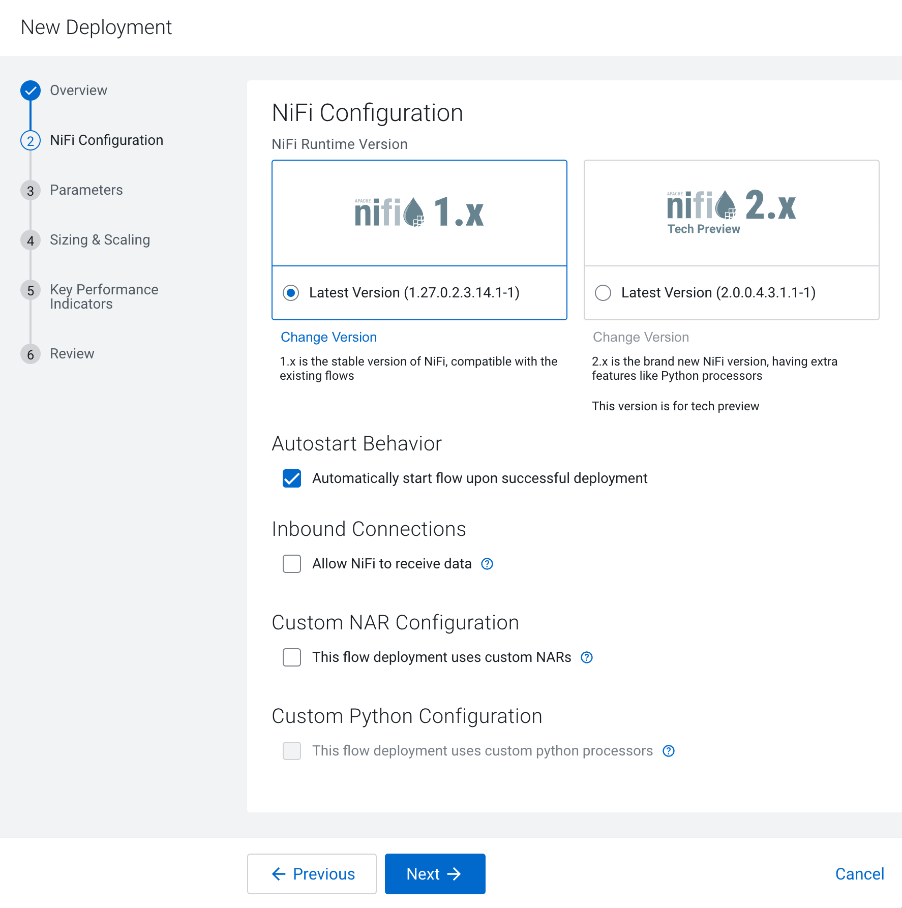
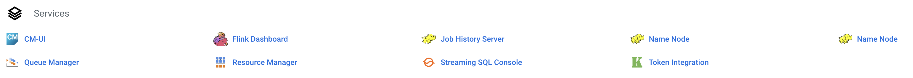
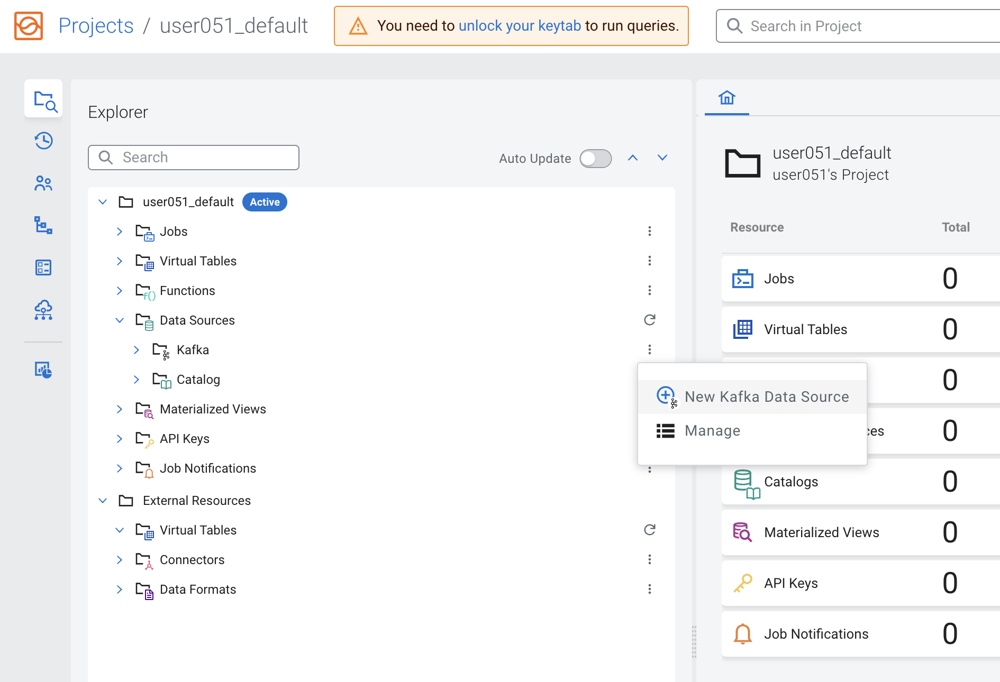
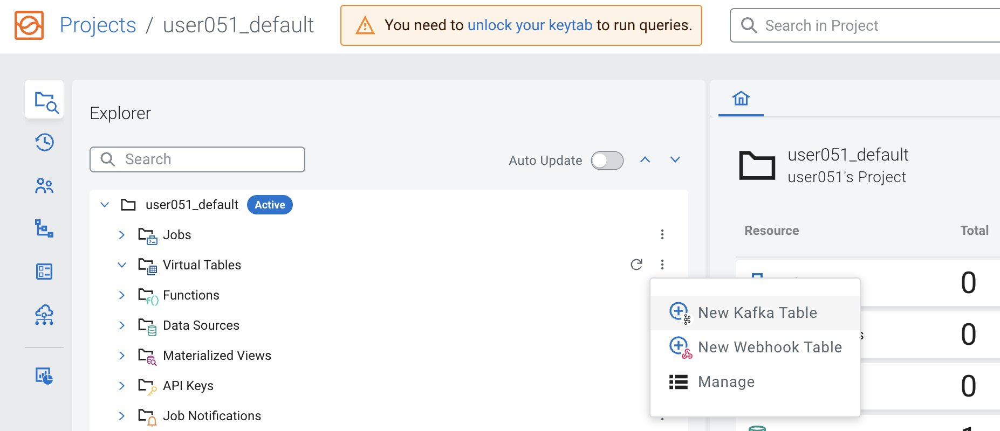

# Cloudera DataFlow (CDF) Hands-on Lab

---

## Data Distribution with Cloudera DataFlow

### 1. Overview

In this module you will practice creating, testing and deploying a flow in CDF PC. You will learn to:
* Develop flows using the low-code Flow Designer.
* Create a test session and interactively test a flow.
* Version-control a flow into the DataFlow Catalog.
* Deploy a flow on an auto-scaling production cluster on k8s. 
* You'll also learn flow design best practices like:
    * Create self-contained flow within a Process Group
    * Parameterize flows for reusability
    * Set meaningful names for flow components, including queues (inplace of Success, Fail, and Retry). These names will be used to define Key Performance Indicators in CDF-PC.

The following is a step by step guide in building a data flow for use within CDF-PC.


### 2. Create a schema in Schema Registry

1.	Login to **Schema Registry** by clicking the appropriate hyperlink in the **Streams Messaging Datahub**.

    

2.	Click on the **+ button** on the top right to create a new schema.
3.	Create a new schema with the following information: 

    **Note**: The name of the schema (e.g "userx-syslog-avro") must match the name of the Kafka topic you will create later.

* Name: **\<userid>-syslog-avro**
* Description: **syslog schema for dataflow workshop**
* Type: **Avro schema provider**
* Schema **Group: Kafka**
* Compatibility: **Backward**
* Evolve: **True**
* Schema Text:

```
    {
    "name": "syslog",
    "type": "record",
    "namespace": "com.cloudera",
    "fields": [
        { "name": "priority", "type": "int" },
        { "name": "severity", "type": "int" },
        { "name": "facility", "type": "int" },
        { "name": "version", "type": "int" },
        { "name": "timestamp", "type": "long" },
        { "name": "hostname", "type": "string" },
        { "name": "body", "type": "string" },
        { "name": "appName", "type": "string" },
        { "name": "procid", "type": "string" },
        { "name": "messageid", "type": "string" },
        { "name": "structuredData",
        "type": {
            "name": "structuredData",
            "type": "record",
            "fields": [
            { "name": "SDID",
                "type": {
                "name": "SDID",
                "type": "record",
                "fields": [
                    { "name": "eventId", "type": "string" },
                    { "name": "eventSource", "type": "string" },
                    { "name": "iut", "type": "string" }
                ]
                }
            }
            ]
        }
        }
    ]
    }
```

---

## 3. Design the flow in the Flow Designer

---

### 3.1 Open the prepared draft flow

1. In Cloudera DataFlow, go to **Catalog** and look for **CDF Workshop draft** 

    


2. To create your flow, click on the **CDF Workshop draft** and select () click continue and name the flow **\<userid>-syslog-kafka-flow**

    


### 3.2 Configure parameters for the flow
Configure parameters for the flow

*Parameters are created within Parameter Contexts. In the context of CDP Flow Designer, one default Parameter Context is auto-created when you create a new draft flow.*

*You can then add parameters to this one Context, you cannot create additional ones.*

This default context is automatically bound to each Process Group you create within y*our draft Flow, making all parameters available to be used in any process group.*

1. To create a Parameter, click on **Flow Options** in the top right corner and select Parameters
    
    

2. Add the parameters. Click on **Add Parameter > Add Parameter** for each parameter to be added and enter the appropriate details:

    | Name  | Description | Value |
    | ----------------- | ------------- | ------------- |
    | CDP Workload User	| CDP Workload User | **\<Your own workload user name>**|
    | Filter Rule | Filter Rule | **SELECT * FROM FLOWFILE**|
    | Kafka Broker Endpoint| Comma-separated list of Kafka broker addresses	| **\<Comma-separated list of Kafka broker addresses. See notes below>**|
    | Kafka Destination Avro Topic |Target Kafka topic name for AVRO messages| **\<userid>-syslog-avro**|
    | Kafka Destination JSON Topic |Target Kafka topic name for JSON messages| **\<userid>-syslog-json**|
    | Kafka Producer ID |Client ID of Kafka producer| **\<userid>-producer**|
    | Schema Name |Schema name for AVRO Kafka topic| **\<userid>-syslog-avro**|
    | Schema Registry Hostname |Hostname of Cloudera Schema Registry| **\<Hostname of Schema Registry service. See notes below>**|


    **Notes:**

    * **Kafka Broker Endpoints:** 
    
        You can find the endpoints of your **Kafka Brokers** in the **Endpoints** view of your Streams Messaging (Kafka) DataHub cluster.

        

        &nbsp;

        
    
        The value for the **Kafka Broker Endpoint** parameter must be a comma-separated list of the broker addresses, as shown in the example below:

        

     * **Schema Registry Hostname:**
    
        You can find the hostname to use as your **Schema Registry Hostname** in the **Nodes** view of your Streams Messaging (Kafka) DataHub cluster.  

        

        The value of **Schema Registry Hostname** is the hostname of the **Master** node:

        

3. Add sensitive parameters. Click on **Add Parameter > Add Sensitive Parameter** for the workload password and enter the appropriate details:

    | Name  | Description | Value |
    | ----------------- | ------------- | ------------- |
    | CDP Workload User Password | CDP Workload User Password | **\<Your own workload password for the environment>**|

4. Once all the parameters have been created verify with the list below

    

5. Click **Apply Changes** and then **Back To Flow Designer** to go back to the Flow Designer main page.

### 3.3 Create Controller Services

*Controller Services are extension points that provide information for use by other components (such as processors or other controller services). The idea is that, rather than configure this information in every processor that might need it, the controller service provides it for any processor to use as needed.*

1. Enable the Test Session before configuring the services.

    * Select **Flow Options > Test Session**. Use the latest NiFi version (default).
    * Click the **Start** button to start a test session. The test session status changes to **Initializing Test Session**. 
    * Wait for the status to change to Active Test Session.

    

    You are not yet at the point of testing the flow, but enabling a test session forces the **Default Nifi SSL Context Service** controller service to be created, which you will need in the next steps.

    


2. Click **Flow Options > Services**

    **Note**: Make sure you have a test session running to run your flow. 

    


---

**Tip:** When type parameters into a property value you can use the following technique to see the list of available parameters:


---
&nbsp;

3. Add a new **HortonworksSchemaRegistry** controller service

    * Click Add Service. The Add Service page opens.

        


    * In the text box, filter for **HortonworksSchemaRegistry**, select it and click **Add**
    * Configure the HortonworksSchemaRegistry service with the Service name **WS_CDP_Schema_Registry** and add the following properties:
        

        | **Property**  | **Value** |
        | ----------------- | ------------- | 
        | Schema Registry URL | https://#{Schema Registry Hostname}:7790/api/v1 |
        | SSL Context Service | Default Nifi SSL Context Service |
        | Kerberos Principal | #{CDP Workload User} |
        | Kerberos Password | #{CDP Workload User Password} |

        This is how the configuration should look like:

        

    * Click Apply
    * Activate the service by clicking on the Enable Icon

        
    

4. Add a new **Syslog5424Reader** controller service with the service name **WS_Syslog_5424_Reader**. Then click **Apply** and activate the service by clicking on the "Enable Icon".


5.	Add a new **JsonTreeReader controller service** with the service name **WS_JSON_Syslog_Reader** and add the following properties. Then click **Apply** and activate the service by clicking on the "Enable Icon".


    | **Property**  | **Value** |
    | ----------------- | ------------- | 
    | Schema Access Strategy | **Use ‘Schema Name’ Property** |
    | Schema Registry | **WS_CDP_Schema_Registry** |
    | Schema Name | **#{Schema Name}** |

    This is how the configuration should look like:

    

6.	Add a new **JsonRecordSetWriter controller service** with the service name **WS_JSON_Syslog_Writer**, add the following properties and click *Apply*

    | **Property**  | **Value** |
    | ----------------- | ------------- | 
    | Schema Access Strategy | **Use ‘Schema Name’ Property** |
    | Schema Registry | **WS_CDP_Schema_Registry** |
    | Schema Name | **#{Schema Name}** |

    This is how the configuration should look like:

    

7.	Add a new **AvroRecordSetWriter controller service** with the service name **WS_Avro_Syslog_Writer**, add the following properties and click *Apply*

    | **Property**  | **Value** |
    | ----------------- | ------------- | 
    | Schema Write Strategy | **HWX Content-Encoded Schema Reference** |
    | Schema Access Strategy | **Use ‘Schema Name’ Property** |
    | Schema Registry | **WS_CDP_Schema_Registry** |
    | Schema Name | **#{Schema Name}** |

    This is how the configuration should look like:

    

8. This completes the configurations of all the controller services. Please verify with the list below and make sure that all controller services are **enabled**

    

9.	Click on the **Back to Flow Designer** link to go back to the flow canvas

&nbsp;

### 3.4 Design the flow

1.	Open the **Flow Design** page
2.	Create the **Generate Syslog RFC5424** processor

    1. Click on the **Processor** icon and drag it onto the canvas

        

    2. Select the **ExecuteScript** processor.
    3. Configure the processor as follows:

        | **Property**  | **Value** |
        | ----------------- | ------------- | 
        | Processor Name | **Generate Syslog RFC5424** |
        | Concurrent Tasks | **4** |
        | Run Schedule: | **1 sec** |
        | Execution | **Primary Node** |

        

    4. Properties:

        | **Property**  | **Value** |
        | ----------------- | ------------- | 
        | Script Engine | **python** |
        | Script Body | **see script below** 
  
        **\<copy and paste the following script>**
        
        ```
        ##
        ## Author: Nasheb Ismaily
        ## Description: Generates a random RFC5424 format syslog message
        ##
        
        from org.apache.commons.io import IOUtils
        from java.nio.charset import StandardCharsets
        from org.apache.nifi.processor.io import OutputStreamCallback
        import random
        from datetime import datetime
        
        class PyOutputStreamCallback(OutputStreamCallback):
            def __init__(self):
                pass
        
            def process(self, outputStream):
                hostname = "host"
                domain_name = ".example.com"
                tag = ["kernel", "python", "application"]
                version = "1"
                nouns = "application"
                verbs = ("started", "stopped", "exited", "completed")
                adv = ("successfully", "unexpectedly", "cleanly", "gracefully")
        
                for i in range(1,10):
                    application = "{0}{1}".format(nouns, random.choice(range(1, 11)))
                    message_id = "ID{0}".format(random.choice(range(1, 50)))
                    random_tag = random.choice(tag)
                    structured_data = "[SDID iut=\"{0}\" eventSource=\"{1}\" eventId=\"{2}\"]".format(random.choice(range(1, 10)), random_tag, random.choice(range(1, 100)))
                    time_output = datetime.utcnow().strftime('%Y-%m-%dT%H:%M:%S.%f')[:-3] + 'Z'
                    random_host = random.choice(range(1, 11))
                    fqdn = "{0}{1}{2}".format(hostname, random_host, domain_name)
                    random_pid = random.choice(range(500, 9999))
                    priority = random.choice(range(0, 191))
                    num = random.randrange(0, 4)
                    random_message = application + ' has ' + verbs[num] + ' ' + adv[num]
        
                    syslog_output = ("<{0}>{1} {2} {3} {4} {5} {6} {7} {8}\n".format(priority, version, time_output, fqdn, application,random_pid, message_id,structured_data, random_message))
                    outputStream.write(bytearray(syslog_output.encode('utf-8')))
        
        flowFile = session.create()
        if (flowFile != None):
            flowFile = session.write(flowFile, PyOutputStreamCallback())
            session.transfer(flowFile, REL_SUCCESS)
        ```
        

    4. **Relationships**: check **Terminate** for the **failure** relationship

        

    5. Click Apply

        

3.	Create the Filter Events processor

    1. Drag the Processor icon onto the canvas
    2. Select the **QueryRecord** processor.
    3. Configure the processor as follows:

        * Processor Name: **Filter Events**
        * Add the following properties

            | **Property**  | **Value** |
            | ----------------- | ------------- | 
            | Record Reader | **WS_Syslog_5424_Reader** |
            | Record Writer | **WS_JSON_Syslog_Writer** |


        * Click on the Add Property button to add a new property:

            | **Property**      | **Value** |
            | ----------------- | ------------- | 
            | filtered_event | **#{Filter Rule}** |
        
            
        
        * Relationships: check **Terminate** for the **failure** and **original** relationships

            
        * Click **Apply**
        &nbsp;
        &nbsp;

            Your flow should like this now

            

4.	Create the **Write To Kafka - Avro processor**

    1. Drag the Processor icon onto the canvas
    2. Select the **PublishKafka2RecordCDP** processor.
    3. Configure the processor as follows:

        * Processor Name: **Write To Kafka - Avro**
        * Configure the following properties

            | **Property**  | **Value** |
            | ----------------- | ------------- | 
            | Kafka Brokers| **#{Kafka Broker Endpoint}** |
            | Topic Name| **#{Kafka Destination Avro Topic}** |
            | Record Reader| **WS_JSON_Syslog_Reader** |
            | Record Writer| **WS_Avro_Syslog_Writer** |
            | Use Transactions| **false** |
            | Security Protocol| **SASL_SSL** |
            | SASL Mechanism| **PLAIN** |
            | Username| **#{CDP Workload User}** | 
            | Password| **#{CDP Workload User Password}** | 
            | SSL Context Service| **Default NiFi SSL Context Service** |

            

        * To set a specific id for the producer, click on the **Add Property** button to add a new property:

            | **Property**      | **Value** |
            | ----------------- | ------------- | 
            | client.id  | **#{Kafka Producer ID}** |

            

        * Relationships: check **Terminate** for the **success** relationship
        * Click **Apply**

        

5.	Create the **Write To Kafka - JSON processor**

    1. Drag the Processor icon onto the canvas
    2. Select the PublishKafka2RecordCDP processor.
    3. Configure the processor as follows:

        * Processor Name: **Write To Kafka - JSON**
        * Add the following properties

            | **Property**  | **Value** |
            | ----------------- | ------------- | 
            | Kafka Brokers| **#{Kafka Broker Endpoint}** |
            | Topic Name| **#{Kafka Destination JSON Topic}** |
            | Record Reader| **WS_JSON_Syslog_Reader** |
            | Record Writer| **WS_JSON_Syslog_Writer** |
            | Use Transactions| **false** |
            | Security Protocol| **SASL_SSL** |
            | SASL Mechanism| **PLAIN** |
            | Username| **#{CDP Workload User}** | 
            | Password| **#{CDP Workload User Password}** | 
            | SSL Context Service| **Default NiFi SSL Context Service** |

        * To set a specific id for the producer, click on the **Add Property** button to add a new property:

            | **Property**      | **Value** |
            | ----------------- | ------------- | 
            | client.id  | **#{Kafka Producer ID}** |

            
        * Relationships: check **Terminate** for the **success** relationship
        * Click **Apply**

            

6.	Connect the processors as shown in the diagram below:

    * Connect the Processors **Generate Syslog RFC5424 & Filter Events** for Relationship **success**
    * Connect Processors **Filter Events & Write To Kafka - Avro** for Relationship **filtered_events**
    * Connect Processors **Filter Events & Write To Kafka - JSON** for Relationship **filtered_events**
    * Connect **Write To Kafka - JSON** to itself to retry for **failures**
    * Connect **Write To Kafka  AVRO** to itself to retry for **failures**

        

### 3.5 Naming the queues

Providing unique names to all queues is important when creating flows in CDP-PC. The queue names are used to define Key Performance Indicators and having unique names for them make it easier to understand and create CDF-PC dashboards.

To name a queue, double-click the queue and give it a unique name. The best practice here is to start with the existing queue name (i.e. success, failure, retry, etc…) and, if that name is not unique, add the source and destination processor to the name.

For example:
* The success queue between **"Generate Syslog RFC5424"** and **"Filter Events"** should be named **"success_Generate-FilterEvents"** 
* The success queue between **"Filter Events"** and **"Write To Kafka - JSON"** should be named **"filtered_events_WriteToKafka_JSON"**
* The success queue between **"Filter Events"** and **"Write To Kafka - AVRO"** should be named **"filtered_events_WriteToKafka_AVRO"**
* The failure retry queue from "**Write To Kafka - JSON**" to itself should be named **"failure_WriteToKafka_JSON"**
* The failure retry queue from "**Write To Kafka - AVRO**" to itself should be named **"failure_WriteToKafka_AVRO"**

    


## 4. Interactively test the flow

Test sessions are a feature in the CDF Flow Designer that allow you to start/stop processors and work with live data to validate your data flow logic. 

To test your draft flow, start a Test Session by clicking **Flow Options > Test Session > Start Test Session**. This launches a NiFi sandbox to enable you to validate your draft flow and interactively work with live data by starting and stopping components.

Tip: You can check the status of your Test Session in the upper right corner of your workspace. That is where you can also deactivate your Test Session.


1.	If your test session is not yet started, start one by clicking on **Flow Options > Test Session > Start**.

    **Note: If you had previously started and stopped a test session, the Start button is replaced with the Restart button. Clicking on Restart restarts the session with the same settings used previously. If you want to change the settings, click on the Edit Settings button.**

2.	Click **Start Test Session** (accept all defaults). Test session status changes to **Initializing Test Session**…
 
3.	Wait for the status to change to **Active Test Session**.

4.	Click **Flow Options > Services** to enable Controller Services, if not already enabled. 

5.	Start all processors that are not running.

    Stopped processors are identified by the icon . Right-click on a stopped processor and select **Start** to start it.

    The flow starts executing. On the **Flow Design** canvas you can observe statistics on your processors change as they consume data and execute their respective tasks. 

    

    You should see the flow running successfully and writing records to Kafka.

6.	Access the SMM UI from the **Streams Messaging DataHub** page and check the topic metrics and data:

    

    Here are the topic metrics:

    

    You can also view the data from the data explorer:  
    

7.	You can see that the data in that topic is binary (lots of garbage-like characters on the screen. This is because the topic contains Avro messages, which is a binary serialization format.

    Fortunately, SMM is integrated to Schema Registry and can fetch the correct schema to properly deserialize the data and present a human-readable form of it.
    To do that select Avro as the Values Deserializer for the topic:

    

    You will notice that after Avro is selected the messages are shown with a readable JSON encoding:
    
    

## 5. Version Control the flow into the DataFlow Catalog 

When your flow draft has been tested and is ready to be used you can publish it to the **DataFlow Catalog** so that you can deploy it from there.

On the first time a flow draft is exported to the catalog you are asked to provide a name for the flow. This name must be unique and must not already exist in the catalog. After a flow is published, subsequent changes that are published will be saved in the catalog as new versions using the same name provided the first time. This name cannot be changed.

When you want to publish a draft flow as a flow definition, you have two options: 

* On the Flow Design Canvas, click **Flow Options > Publish To Catalog > Publish**

    

OR

* Click on Flow Design (left-hand side) to see the All Flows page, which lists all the flows. Then click on the menu icon () for the flow you want to publish and select View Flow 

    

* This will take you to the list of all flows running on the same environment (workspace) as the flow you selected. To publish the flow, Workspace view, click again on the   menu for the desired flow and select **Publish Flow**. 

    


1.	Choose one of the methods explained above and publish your flow.
2.	In the Publish Flow dialog box, enter the following details:
    1. Flow Name: only when you publish your flow for the first time.
    2. Flow Description: only when you publish your flow for the first time e.g. "Flow generates syslog messages and writes them to Kafka"
    3. Version Comments: every time a flow version is published.

    

3.	Click **Publish**.
4.	Click on **Catalog** and verify that your flow was successfully published.
5.	Make a simple change to your flow (e.g move processors to different positions)
6.	Publish your flow again.
7.	Check that your flow in the Catalog has multiple versions now.

## 6. Deploy the flow in Production

1. Search for the flow in the Flow Catalog

    

2.	Click on the Flow to see its details, including the list of versions

    

3. Click on **Version 1**, you should see a **Deploy** option appear shortly. Then click on **Deploy**.

    

4.	Select the CDP environment where this flow will be deployed and click **Continue**.

    

5. Give the deployment a unique name (e.g **\<userid>-syslog-to-kafka-001**) and select a **Target Project** then click **Next**.

    

6. In the **NiFi Configuration** page, accept all the defaults (no need to change runtime version, autostart behavior, inbound connections and custom NAR) and click **Next**.

    

7. In the **Parameters** page, provide the correct values for the parameter for the production run and then click **Next**. Most of the parameters already have good defaults and you only need to change them if needed. However, you must re-enter the **CDP Workload User Password**.

    | **Property**  | **Value** |
    | ----------------- | ------------- | 
    | CDP Workload User | **The workload username for the current user** |
    | CDP Workload Password | **The workload password for the current user** |
    | Kafka Broker Endpoint | **Comma separated list of Kafka Brokers** |
    | Kafka Destination Avro Topic | **\<userid>-syslog-avro** |
    | Kafka Destination JSON Topic | **\<userid>-syslog-json** |
    | Kafka Producer ID | **\<userid>-producer** |
    | Schema Name | **\<userid>-syslog-avro** |
    | Schema Registry Hostname | **The hostname of the master server in the Kafka Datahub** |
    | Filter Rule | **SELECT * FROM FLOWFILE** |

8. In the **Sizing & Scaling** dialog, select the following and then click **Next**:

    | **Property**  | **Value** |
    | ----------------- | ------------- | 
    | Size | **Extra Small** |
    | Enable Auto Scaling | **Enabled** |
    | Min Nodes | **1** |
    | Max Nodes | **3** |

9. In the Key Performance Indicators page, click on Add New KPI to add the following KPIs.

    

    1.	Add the following KPI

        | **Property**  | **Value** |
        | ----------------- | ------------- | 
        | KPI Scope | **Connection** |
        | Connection Name | **failure_WriteToKafka_AVRO** |
        | Metrics to Track | **Bytes Queued** |
        | Trigger alert when metric is greater than (enable checkbox) | **1 MBytes**  |
        | Alert will be triggered when metrics is outside the boundary(s) for | **30 seconds** |

        

    2. Add the following KPI

        | **Property**  | **Value** |
        | ----------------- | ------------- | 
        | KPI Scope | **Connection** |
        | Connection Name | **filtered_event_WriteToKafka_AVRO** |
        | Metrics to Track | **Bytes Queued** |
        | Trigger alert when metric is greater than (enable checkbox) | **10 KBytes**  |
        | Alert will be triggered when metrics is outside the boundary(s) for | **30 seconds** |

        

10.	Review the KPIs and click Next.

    

11.	In the Review page, review your deployment details.

    Notice that in this page there's a **>_ View CLI Command** link, which allows you to automate the flow deployment using the CDP CLI.

12.	Click Deploy to initiate the flow deployment.

13.	In the DataFlow **Dashboard**, monitor your flow until it's running successfully (a green check mark will appear once the deployment has completed)
         
    

14.	 Click on your deployment and explore the flow details and monitor the KPI metrics that are shown on this page.

15.	Then click on **Manage Deployment** and explore the options under Deployment Settings, which allow you to manage your production flow deployment.

16.	Explore the links in the **Actions** menu on this page.


## Streaming Analytics with Cloudera Stream Processing

### Overview

In this module you will practice the streaming analytic capabilities of Cloudera Stream Processing using SQL Stream Builder to develop and deploy a real-time streaming job in production. You will leverage the NiFi Flow deployed in CDF-PC from the previous workshop and demonstrate how to query live data and subsequently sink it to another location. You will learn to:
* Use Stream Messaging Manager to inspect Kafka topics.
* Create a Project in SQL Stream Builder (SSB).
* Register Schema Registry and Kudu Catalogs in SSB.
* Create Virtual Tables in SSB.
* Create and execute Jobs in SSB.

### 1. Open SQL Streams Builder (SSB)

* Open **SQL Streams Builder (SSB)** by clicking the **Streaming SQL Console** hyperlink in the **Streaming Analytics Datahub cluster**.

    

* Open the default project for your current user e.g. **\<userid>_default** 

    

### 2. Register a Kafka Data Source

Before you can use SSB to process data from Kafka topics you must register one or more Kafka clusters as Data Sources in your project. In this section you will register the Kafka DataHub as your data source.

1.	In your project workspace, expand the Data Sources item in the navigation tree. You will see two items under it: "Kafka" and "Catalog"
2.	Click on the menu icon () under **Data Sources > Kafka** to create a **New Kafka data source**:

    

3.	Provide the following details in the Kafka Data Source dialog box and click the **Validate** Link. Click **Create** once your data source is valid:


    | **Property**  | **Value** |
    | ----------------- | ------------- | 
    | Name | **\<name of your data source. E.g. dh-kafka>** |
    | Brokers | **<comma-separated list of brokers> (See the Notes under section "3.2 Configure parameters for the flow" for more details on how to find the Kafka broker addresses)** |
    | Protocol | **SASL/SSL** |
    | SASL Mechanism | **PLAIN** |
    | SASL Username | **\<your workload username>** |
    | SASL Password | **\<your workload password>** |
    
    


### 3. Register a Schema Registry catalog

Schema Registry stores schemas that are used to read/write data from/to Kafka topics. Registering a Schema Registry instance in SSB automatically creates SSB tables for the schemas retrieved from it, making it simpler to start accessing data from those topics.

**Note:** For this to work the schemas stored in Schema Registry need to be stored with the same name of the Kafka topic.

1.	In your project workspace, navigate to **Data Sources > Catalog**. Click the menu icon () of the Catalog and select **New Catalog** to create a new catalog.

    

2.	Enter the following details in the Catalog dialog box:

| **Property**  | **Value** |
| ----------------- | ------------- | 
| Catalog Type | **Schema Registry** |
| Name | **\<name of the catalog. E.g. dh-schreg>** |
| Kafka Cluster | **\<select the Kafka data source you created the previous section>** |
| Enable TLS | **Enabled** |
| Schema Registry URL | **https://<schreg_hostname>:7790/api/v1 (See the Notes under section "3.2 Configure parameters for the flow" for more details on how to find the Kafka broker addresses)** |


3.	Click on the **Validate** button to validate the Catalog. If the catalog is successfully validated you will see a message saying "Data Source is valid". If you hover the mouse over that message you will see how many tables were discovered from Schema Registry during the validation:

    


4.	Once the catalog is validated. Press the Create button to register the Schema Registry catalog.

    

5.	After the registration is completed you can browse the Schema Registry tables by navigating to External **Resources> Virtual Tables > [schema_registry_catalog_name] > default_database**:


    **Note**: The Virtual Tables are created based on the schemas retrieved from Schema Registry. Virtual table names are the same as that of schema names.  The topic names in Kafka must also be the same as the name of the schema associated with it.

    


### 4. Register a Kudu catalog

Similar to a Schema Registry catalog, a Kudu catalog makes Kudu tables automatically available for use in SSB, simplifying the process of mapping Virtual Tables to the actual Kudu ones. In this section you will register the DataHub Kudu cluster as a catalog in your SSB project.

This will make the **syslog_severity** table, which has already been created in Kudu, available for queries in SSB.

1.	In your project workspace, navigate to **Data Sources -> Catalog**. Click the kebab menu of the Catalog item and select **New Catalog** to create a new catalog.

2.	Enter the following details in the Catalog dialog box:

    | **Property**  | **Value** |
    | ----------------- | ------------- | 
    | Name | **\<name of of the catalog. E.g. dh-kudu>** |
    | Catalog Type | **Kudu** |
    | Kudu Masters | **\<kudu_master1>:7051,\<kudu_master2>:7051,\<kudu_master3>:7051** |

    

**Notes:**
* Kudu Masters: The hostname of the Kudu master nodes can be found in the Real-time Data Mart (Kudu) DataHub page. In the CDP Console, find your Real-time Data Mart DataHub and click on the Nodes tab. Copy the FQDN for the 3 masters, as shown in the screenshot below.

    The full masters address to be provided during the catalog registration is the following:

    

    &nbsp;

    

3.	Click on the Validate link to validate the Catalog. Once the catalog is successfully validatedp click the **Create** button to register the Kudu catalog.

    

4.	After the registration is completed you can browse the Kudu tables by navigating to **External Resources> Virtual Tables > [kudu_catalog_name] > default_database:**
    
    


### 5. Create a Kafka Table manually
You saw that when you register a Schema Registry catalog SSB automatically maps all the schemas found in there as SSB tables that can be used to access data in the Kafka topics named after the schemas.

Sometimes, though, you don't have a schema for a particular topic and you may still want to consume or produce data to that topic. In SSB you can manually create a table and specify its schema directly, as well as the mapping to an existing Kafka topic. In this section you will practice this using the Add Table wizard.

1. In your project workspace, navigate to Data Sources -> Virtual Tables. 

2. Click the menu icon ()  of the Virtual Tables item and select New Kafka Table to create a new virtual table.

    

3.	Enter the following details in the Kafka Table dialog box:

    | **Property**  | **Value** |
    | ----------------- | ------------- | 
    | Table Name | **\<userid>_syslog_data** |
    | Kafka Cluster | **\<select the Kafka data source you created previously>** |
    | Data Format | **JSON** |
    | Topic Name | **\<userid>-syslog-json** |

    

4.	When you select Data Format as AVRO, you must provide the correct Schema Definition when creating the table for SSB to be able to successfully process the topic data.

    For JSON tables, though, SSB can look at the data flowing through the topic and try to infer the schema automatically, which is quite handy at times. Obviously, there must be data in the topic already for this feature to work correctly.

    **Note**: SSB tries its best to infer the schema correctly, but this is not always possible and sometimes data types are inferred incorrectly. You should always review the inferred schemas to check if it's correctly inferred and make the necessary adjustments.

    Since you are reading data from a JSON topic, go ahead and click on **Detect Schema** to get the schema inferred. You should see the schema be updated in the **Schema Definition** tab.

5.	You will also notice that a "Schema is invalid" message appears upon the schema detection. If you hover the mouse over the message it shows the reason:

    

    You will fix this in the next step.

6.	Each record read from Kafka by SSB has an associated timestamp column of data type TIMESTAMP ROWTIME. By default, this timestamp is sourced from the internal timestamp of the Kafka message and is exposed through a column called eventTimestamp. 

    However, if your message payload already contains a timestamp associated with the event (event time), you may want to use that instead of the Kafka internal timestamp.

    In this case, the syslog message has a field called "timestamp" that contains the timestamp you should use. You want to expose this field as the table's "event_time" column. To do this, click on the Event Time tab and enter the following properties:


    | **Property**  | **Value** |
    | ----------------- | ------------- | 
    | Use Kafka Timestamps | **Disable** |
    | Input Timestamp Column | **timestamp** |
    | Event Time Column | **event_time** |
    | Watermark Seconds | **3** |


    

7.	Now that you have configured the event time column, click on **Detect Schema** again. You should see the schema turn valid:

    

8.	Click the **Create and Review** button to create the table.
9.	Review the table's DDL and click **Close**.

### 6. Unlock your keytab

Before running jobs in SSB you must unlock your keytab following the steps below:

1.	Ensure you are at the SSB home page. If not in the home page, click the Projects link at the top of the screen
2.	Click on your user's icon/name at the bottom-left of the screen and select Manage Keytab

    

3.	Enter your username and password and click on Unlock Keytab

    

4. You will see the following screen once your keytab was unlocked successfully

    

### 9. Create Streaming SQL jobs

In this section you will practice creating and executing SQL Streaming jobs to implement different types of use cases. You will create the following jobs:

* Job 1: Selecting records from a Kafka virtual table
* Job 2: Selecting records from a Schema Registry virtual table
* Job 3: Using a windowing function
* Job 4: Enriching streaming data with data-at-rest data sources

#### Job 1: Selecting records from a Kafka virtual table

1.	In the SSB console, ensure you have switched to your project and you are at your project's main page.
2.	On the Explorer view, click the kebab menu ( )  of the Jobs item and select New Job to create a new one.

    

3. Enter job1 as a Job Name and click on the Create button:

    

    You are redirected to the SQL Editor where you can perform a number of tasks, including:
    * Compose and execute SQL queries
    * Create and manage Materialized Views
    * Configure your SQL job
    
        
    
4.	Click on the SQL editor area and type the job query.

    In this first job you will simply select everything from the syslog_data table that you created previously. Notice that the editor has auto-completion for keywords, table names, etc. As you type you will see suggestions for completion being shown. To select one of the options, simply use the arrow keys to scroll to the option and press \<ENTER>.

    If the list of options doesn't not show at a particular position of the cursor you can press <CTRL>+<SPACE> to show the list of completion suggestions.

5.	In the editor type "SELECT * FROM " (with a space in the end) and then press \<CTRL>+\<SPACE>. Select the syslog_data table from the list.

    

6.	Click Execute.

    The Logs tab will show that the job execution has started and once data is retrieved it will automatically switch to the Results tab to show the results:

    * Results Tab
    
        

    * Logs Tab
    
        

7.	You will notice that the Results tab shows approximately one record every second, even though there is a lot more data flowing through the Kafka topic. This is because, by default, SSB only shows a sample of the data on the screen to give the user some feedback about what the query is retrieving. If you leave the query running you will also notice that the sample polling will automatically stop once 100 records have been retrieved.

    You can change the sample behavior and other settings by clicking on the Job Settings button, as shown below:

    

    **Note**: Selecting "Sample all messages" can have a negative effect in performance and will increase the resource consumption of your browser as well. Use this only when necessary to check or troubleshoot data.

8.	From the Results tab you can see that the data contains records of all severities. If you want to change that you can simply stop and edit your query and run it again.

    Click Stop to stop the job and append **"WHERE severity = 3"** to the query so that it retrieves only records with severity 3:

    ```
    SELECT *
    FROM <user_id>_syslog_data
    WHERE severity = 3
    ```
    
    Click Execute and check the results to confirm that the change was effective.

9.	Once you're done, Stop your job. In the Explorer tree you can see all the jobs and which ones are running. You can also stop jobs from there by right-clicking on the job item. If the job status doesn't look correct, try click on the Reload icon, shown below:

    


#### 9.2. Job 2: Selecting records from a Schema Registry virtual table

Once virtual tables are created in SSB, their backend and data format are transparent to the user. Tables can be queried in SSB in exactly the same way. In this section you will execute the same query from job1 against a table that comes from an Kafka topic with AVRO format and will see that everything works the same:

1.	On the Explorer view, right-click on the Jobs item and select New Job to create a new job. Call it **\<userid>_job2**.

2.	Enter the same query from the previous job, but using the <userid>-syslog-avro table (use the auto-completion to find the correct table name - <CTRL>+<SPACE>). You will notice that the auto-completion will prefix the table name with the catalog and database names:

    ```
    SELECT *
    FROM [auto-complete the table <userid>-syslog-avro]
    WHERE severity = 3
    ````

    Click **Execute** and check the results to verify that everything works as expected.

    


3.	Once you're done, **Stop** your job.


#### 9.3. Job 3: Using a windowing function

One powerful feature of Flink and SSB is the ability to perform windowing aggregations on streaming data. For more information on all the aggregation options available, please check the Flink documentation about table-valued functions, window aggregation, group aggregation and over aggregation.

In this section you will write a query that defines a sliding (HOP) window on the syslog stream to count how many events of each severity are being generated in intervals of 30 seconds. The 30-second window slides forward every 5 seconds, so the query produces results every 5 seconds for the previous window that ended at that point in time.

1.	On the Explorer view, right-click on the Jobs item and select New Job to create a new job. Call it **\<userid>_job3**.

2.	Enter the following query in the SQL editor (You might have to adjust the table name):

    ```
    SELECT
    window_start, window_end,
    severity,
    count(*) as severity_count
    FROM
    TABLE(
        HOP(TABLE <userid>_syslog_data,
            DESCRIPTOR(event_time),
            INTERVAL '5' SECOND,
            INTERVAL '30' SECOND))
    GROUP BY
    window_start, window_end, severity
    ```

    Click **Execute** and check the results to verify that everything works as expected.

    
    
    Tip: If you're not seeing all the counts for all the severities for each one of the aggregation windows, try setting the sample behavior to "Sample all messages"

3.	Once you're done, **Stop** your job.


#### 9.4. Job 4: Enriching streaming data with data-at-rest data sources

Another powerful feature of Flink/SSB is that you can write queries joining tables that have different backends. A Kafka streaming table, for example, can be joined with batch tables stored in relational databases, Kudu or even HDFS.

This opens a number of possibilities like using data-at-rest tables to enrich streaming data. In this section you will create a job that enriches the aggregation stream produced by the query from job3 by joining it with the syslog_severity table, which is stored in Kudu and has the definition of each one of the severity levels.

1.	On the Explorer view, right-click on the Jobs item and select New Job to create a new job. Call it job4.

2.	Enter the following query in the SQL editor:

    ```
    SELECT
    a.window_start, a.window_end,
    a.severity,
    b.severity_desc,
    count(*) as severity_count
    FROM
    TABLE(
        HOP(TABLE [userid_syslog_data],
            DESCRIPTOR(event_time),
            INTERVAL '5' SECOND,
            INTERVAL '30' SECOND)) a
    JOIN [auto-complete the table default.syslog_severity] b
        ON a.severity = b.severity
    GROUP BY
    a.window_start, a.window_end, a.severity, b.severity_desc
    ````

    Click **Execute** and check the results to verify that everything works as expected.


    

3.	Once you're done, **Stop** your job.


#### 9.5 Job 5 Create a Production job sending data to Kafka

So far, the results of all the jobs that you created were displayed on the screen but not saved anywhere. When you run jobs in production you will want to send the results somewhere (Kafka, databases, Kudu, HDFS, S3, etc.)
SSB makes it really easy to write data to different locations. All you have to do is to create a Virtual Table mapped to that location and then INSERT into that table the results of the query that you are running. You will practice this in this section by modifying job 4 to send its results to a Kafka topic.

You will start by creating a topic to store the results of your query and then modify job4 so that it sends its aggregated and enriched stream output to that topic.


**NOTE: The Kafka topic gets auto-created, so step 1 - 3 are optional**

1.	Open the SMM UI (link is on the Streams Messaging DataHub page)
2.	Click on the **Topics** icon in the left menu (  ) and then on the **Add New** button to create a new topic

3.	Enter the following properties for your topic:

    | **Property**  | **Value** |
    | ----------------- | ------------- | 
    | Topic Name | **\<userid>-severity-counts** |
    | Partitions | **1** |
    | Availability | **MAXIMUM** |
    | Cleanup Policy | **delete** |
        
    

4.	Back in the SSB UI, select **job4** in the Explorer pane to open the SQL editor for it. You should see the aggregation query that you had created in the previous section.

5.	Before you can run this job in production you need to create a Virtual Table in SSB and map it to the **<userid>-severity-counts** Kafka topic that was created above.

    The structure/schema of this table must match the structure of the output of the query that is being executed. Thankfully, SSB has a template feature that makes this very easy to do.

    Click on the **Templates** button above the SQL editor and select **upsert-kafka > json**.

    

    You will notice that a **CREATE TABLE** template was inserted at the beginning of the editor. Scroll up and down to check the contents of the editor. 
    **Please do NOT execute it yet.**

6.	The added template is a CREATE TABLE statement to create a Virtual Table of the type you selected. Before you can execute it you have to complete the template with the missing information.

    Make the following changes to the template:
    1.	Table name: change the table name to **\<userid>_severity_counts**
    2.	Primary key: add the following primary key clause after the last column in the table (severity_count):

        ```
        , PRIMARY KEY (window_start, window_end, severity) NOT ENFORCED
        ```
    
    3.	Remove the line for **bootstrap.servers**
    
        ```
        'properties.bootstrap.servers' = '...',
         ```

    4. Properties: replace all the properties in the WITH clause with the following:
        
        ```
        'connector' = 'upsert-kafka: <data_source_name>',
        'topic' = '<userid>-severity-counts',
        'key.format' = 'json',
        'value.format' = 'json'
        ```

    5.	topic: **\<userid>-severity-counts**

    There are other optional properties commented out in the template that you can ignore. The completed template should look like the one below:
    
    

7.	With your mouse, select only the text of the entire CREATE TABLE statement and click on the **Execute Selection** button to run only that statement and create the Virtual Table.
    
    

    After the CREATE TABLE execution you can see the created table in the Explorer tree:
    
    

8.	Once the table is created successfully, delete the CREATE TABLE statement from the SQL editor.
    
9.	Modify the original query in the editor by adding the following line before the SELECT keyword:
    
    ```
    INSERT INTO <userid>_severity_counts
    ````

    Your final statement should look like this:
    
    

10.	Click on the **Execute** button to submit your job for execution.

11.	You should see the output of the query on the Results tab once the job starts executing. You can close the tab or window at any time and the job will continue running on the Flink cluster.

    

12.	Open the SMM UI again, click on the Topics icon () and search for the **\<userid>-severity-counts** topic.

    

13.	Click on the Data Explorer icon () for the topic  to visualize the data in the topic. You should be able to see recently added data with the aggregations produced by job4:

    
